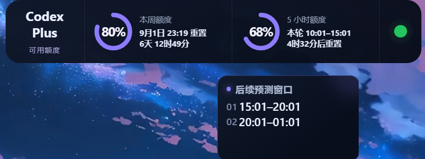
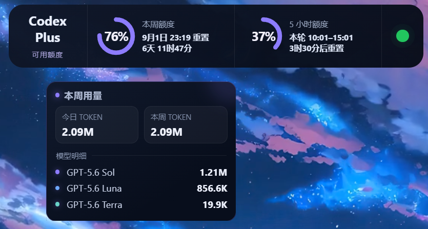

# Codex Monitor

Windows 与 macOS 上的 Codex 用量与对话状态悬浮小组件。

## 最新版下载

当前版本：[Codex Monitor v1.0.7](https://github.com/heiiscyd111-cmd/codex-monitor-widget/releases/tag/v1.0.7)

| 系统 | 下载文件 | 适用设备 |
| --- | --- | --- |
| Windows | [Windows x64 便携版](https://github.com/heiiscyd111-cmd/codex-monitor-widget/releases/download/v1.0.7/CodexMonitor-v1.0.7-Windows-x64-Portable.zip) | Windows 10/11 64 位 |
| macOS Apple 芯片 | [macOS arm64](https://github.com/heiiscyd111-cmd/codex-monitor-widget/releases/download/v1.0.7/CodexMonitor-v1.0.7-macOS-arm64.zip) | M1、M2、M3、M4 等 Apple 芯片 |
| macOS Intel | [macOS x64](https://github.com/heiiscyd111-cmd/codex-monitor-widget/releases/download/v1.0.7/CodexMonitor-v1.0.7-macOS-x64.zip) | “关于本机”中显示 Intel 的 Mac |
| 源码 | [Source ZIP](https://github.com/heiiscyd111-cmd/codex-monitor-widget/releases/download/v1.0.7/CodexMonitor-v1.0.7-Source.zip) | 需要 Node.js 22.12+ |

Windows 和 macOS 安装包均已内置 Electron，不需要另外安装 Node.js、npm 或 OpenAI API Key。使用前需要安装并登录 Codex Desktop；macOS 也支持已经登录的 Homebrew Codex CLI。

## 实机效果

### 主界面


### 主界面与预测浮窗



### 本周用量悬浮窗



## 功能

功能按照主界面从左到右排列：

1. **订阅信息**
   - 自动识别 Free、Plus、Pro 等真实订阅名称。
   - 从本机 Codex 登录信息自动读取订阅有效期；读取不到时可点击日期区域手动设置。
2. **本周额度**
   - 圆环显示本周剩余额度。
   - 显示下次重置时间和倒计时。
   - 鼠标悬停后显示今日 Token、本额度周期 Token，以及各模型 Token 明细。
3. **5 小时额度**
   - 圆环显示当前 5 小时窗口的剩余额度。
   - 显示本轮起止时间和重置倒计时。
   - 鼠标悬停后显示当天后续预测窗口。
   - 账号没有 5 小时限制时自动隐藏此区域，并缩短组件。
4. **运行状态灯**
   - 绿色表示有 Codex 对话正在生成或执行工具。
   - 灰色表示当前没有任务运行。
5. **显示与置顶**
   - 打开 Codex 时自动显示，并在 Codex 位于前台时悬浮。
   - 托盘/菜单栏可切换“始终置顶所有窗口”，并记住选择。

## 界面说明

- **本周额度**：显示剩余百分比、重置日期和倒计时；鼠标悬停后显示今日 Token、本额度周期 Token，以及各模型 Token 明细。
- **5 小时额度**：显示当前窗口、剩余比例和重置倒计时；鼠标悬停后显示当天后续预测窗口。
- **状态灯**：绿色表示有 Codex 对话正在生成或执行工具，灰色表示当前没有任务运行。
- Token 与模型统计来自本机 Codex 日志；内部审核模型不会计入模型明细。

## 下载版本说明

请使用上方链接或仓库右侧 **Releases** 下载，不要下载 GitHub 自动生成的 “Source code”。

### Windows x64 便携版

`CodexMonitor-v1.0.7-Windows-x64-Portable.zip`

- 内置 Electron 运行环境
- 不需要 Node.js 或 npm
- 解压后双击 `CodexMonitor.exe`

### macOS 版

- Apple Silicon：`CodexMonitor-v1.0.7-macOS-arm64.zip`
- Intel：`CodexMonitor-v1.0.7-macOS-x64.zip`
- 内置 Electron，不需要 Node.js 或 npm
- 当前未签名，首次运行需要在“系统设置 → 隐私与安全性”中手动允许

### 轻量源码版

`CodexMonitor-v1.0.7-Source.zip`

- 不内置 Electron
- 需要 Node.js 22.12 或更高版本
- 解压后运行：

```powershell
npm install
npm start
```

## Windows 前置条件

1. Windows 10/11 64 位。
2. 已安装 Windows 版 Codex Desktop。
3. 已在 Codex 中登录自己的 ChatGPT/Codex 账户。
4. 至少启动过一次 Codex。
5. 不需要 OpenAI API Key。

> 没有安装并登录 Codex Desktop 时，小组件无法获得真实额度和对话状态。

## Windows 使用

1. 下载 Portable ZIP。
2. 完整解压到固定文件夹，不要在 ZIP 内直接运行。
3. 双击 `CodexMonitor.exe`。
4. 系统托盘图标右键可以刷新、显示/隐藏、切换“始终置顶所有窗口”或退出。

首次运行后会登记为 Windows 登录启动项，可在“Windows 设置 → 应用 → 启动”关闭。

## macOS 前置条件与使用

1. macOS 14 或更高版本。
2. 安装并登录 Codex 桌面应用；或通过 Homebrew 安装并登录 Codex CLI。
3. Apple M 系列芯片下载 `macOS-arm64.zip`；Intel Mac 下载 `macOS-x64.zip`。
4. 解压后将 `CodexMonitor.app` 移到“应用程序”。
5. 首次启动请按住 Control 点击应用并选择“打开”；若仍被阻止，在“系统设置 → 隐私与安全性”中选择“仍要打开”。
6. 点击菜单栏图标，通过菜单显示/隐藏、刷新、切换“始终置顶所有窗口”或退出。

桌面应用存在时，小组件优先使用其内置 CLI，并支持 Codex 启动检测和前台悬浮。仅安装 Homebrew CLI 时仍可读取额度和本地任务状态，但不提供桌面应用联动与 `codex://` 跳转。完整说明见 [macOS 中文使用说明](USAGE.macOS.zh-CN.txt)。

## 状态灯

- 绿色：至少有一个可见 Codex 对话正在生成或执行工具。
- 灰色：当前没有对话运行。
- 仅打开 Codex、切换窗口或内部审批检查不会点亮。

## 隐私

小组件只读取本机 Codex 状态数据库、日志和登录声明，用于显示额度、Token、运行状态、订阅名称与有效期。登录令牌不会被打印、另存或上传；应用没有自建网络服务。

## 校验下载

每个 Release 包含 `SHA256SUMS.txt`：

```powershell
Get-FileHash .\CodexMonitor-vX.Y.Z-Windows-x64-Portable.zip -Algorithm SHA256
```

```bash
shasum -a 256 CodexMonitor-vX.Y.Z-macOS-arm64.zip
```

## 干净电脑验证

建议使用 Windows Sandbox 或全新 Windows 虚拟机：

1. 不安装 Node.js。
2. 安装并登录 Codex Desktop。
3. 下载、解压 Portable ZIP。
4. 运行 `CodexMonitor.exe`。
5. 检查额度、倒计时和 Token。
6. 发起对话确认绿灯，等待完成确认变灰。
7. 检查悬浮窗、托盘和开机启动。

macOS 还需在真实 Apple Silicon 机器验证完整桌面模式和 CLI-only 模式；Intel 包由 Intel runner 完成架构与启动检查。

GitHub Actions 会构建 Windows x64、macOS arm64、macOS x64 和一个源码包；Codex 登录和完整桌面交互仍需实机验证。

## 从源码构建

```powershell
npm ci
npm run check
npm run build:release
```

输出位于 `dist\`。

macOS：

```bash
npm ci
npm run check
npm run build:mac -- --arch=arm64
```

## 已知限制

- 支持 Windows x64，以及 macOS 14+ 的 Apple Silicon 和 Intel。
- Windows 尚未进行商业代码签名，首次运行可能出现 SmartScreen 提示。
- macOS 内部试用包未签名和公证：首次运行需手动信任，任务完成系统通知不可用，登录自启动仅尽力设置。
- Codex Desktop 更新本地数据结构后可能需要同步适配。

## 商用

本项目允许在遵守 MIT License 的前提下用于商业项目。商用分发必须保留许可证和版权声明，不得冒充 OpenAI/Codex 官方产品；OpenAI、ChatGPT、Codex 等第三方名称与标识不包含在本项目的 MIT 授权中。

完整要求请阅读：[商用要求](COMMERCIAL_USE.md)

## License

[MIT](LICENSE)
