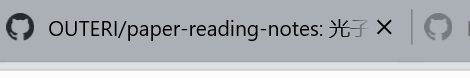
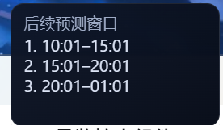

# Codex Monitor

Windows 上的 Codex Plus 用量与对话状态悬浮小组件。

## 功能

- 本周额度、重置时间和倒计时
- 5 小时额度、当前窗口和倒计时
- 当日 Token 使用量
- 后续 5 小时预测窗口
- 对话运行时绿灯、完成后灰灯
- 随 Codex 显示并悬浮在 Codex 上方

## 实机效果

### 主界面



### 后续预测窗口



## 下载哪个版本？

请从仓库右侧 **Releases** 下载，不要下载 GitHub 自动生成的 “Source code”。

### 完整便携版（推荐）

`CodexMonitor-vX.Y.Z-Windows-x64-Portable.zip`

- 内置 Electron 运行环境
- 不需要 Node.js 或 npm
- 解压后双击 `CodexMonitor.exe`

### 轻量源码版

`CodexMonitor-vX.Y.Z-Source.zip`

- 不内置 Electron
- 需要 Node.js 22.12 或更高版本
- 解压后运行：

```powershell
npm install
npm start
```

## 共同前置条件

1. Windows 10/11 64 位。
2. 已安装 Windows 版 Codex Desktop。
3. 已在 Codex 中登录自己的 ChatGPT/Codex 账户。
4. 至少启动过一次 Codex。
5. 不需要 OpenAI API Key。

> 没有安装并登录 Codex Desktop 时，小组件无法获得真实额度和对话状态。

## 完整版使用

1. 下载 Portable ZIP。
2. 完整解压到固定文件夹，不要在 ZIP 内直接运行。
3. 双击 `CodexMonitor.exe`。
4. 系统托盘图标右键可以刷新、显示/隐藏或退出。

首次运行后会登记为 Windows 登录启动项，可在“Windows 设置 → 应用 → 启动”关闭。

## 状态灯

- 绿色：至少有一个可见 Codex 对话正在生成或执行工具。
- 灰色：当前没有对话运行。
- 仅打开 Codex、切换窗口或内部审批检查不会点亮。

## 隐私

小组件只读取本机 Codex 状态数据库和日志，用于显示额度、Token 与运行状态。不会上传对话、账号或额度数据，也没有自建网络服务。

## 校验下载

每个 Release 包含 `SHA256SUMS.txt`：

```powershell
Get-FileHash .\CodexMonitor-vX.Y.Z-Windows-x64-Portable.zip -Algorithm SHA256
```

## 干净电脑验证

建议使用 Windows Sandbox 或全新 Windows 虚拟机：

1. 不安装 Node.js。
2. 安装并登录 Codex Desktop。
3. 下载、解压 Portable ZIP。
4. 运行 `CodexMonitor.exe`。
5. 检查额度、倒计时和 Token。
6. 发起对话确认绿灯，等待完成确认变灰。
7. 检查悬浮窗、托盘和开机启动。

GitHub Actions 会验证语法并构建两个发行包；Codex 登录和桌面交互仍需真实 Windows 环境验证。

## 从源码构建

```powershell
npm ci
npm run check
npm run build:release
```

输出位于 `dist\`。

## 已知限制

- 仅支持 Windows x64。
- 尚未进行商业代码签名，首次运行可能出现 SmartScreen 提示。
- Codex Desktop 更新本地数据结构后可能需要同步适配。

## 商用

本项目允许在遵守 MIT License 的前提下用于商业项目。商用分发必须保留许可证和版权声明，不得冒充 OpenAI/Codex 官方产品；OpenAI、ChatGPT、Codex 等第三方名称与标识不包含在本项目的 MIT 授权中。

完整要求请阅读：[商用要求](COMMERCIAL_USE.md)

## License

[MIT](LICENSE)
